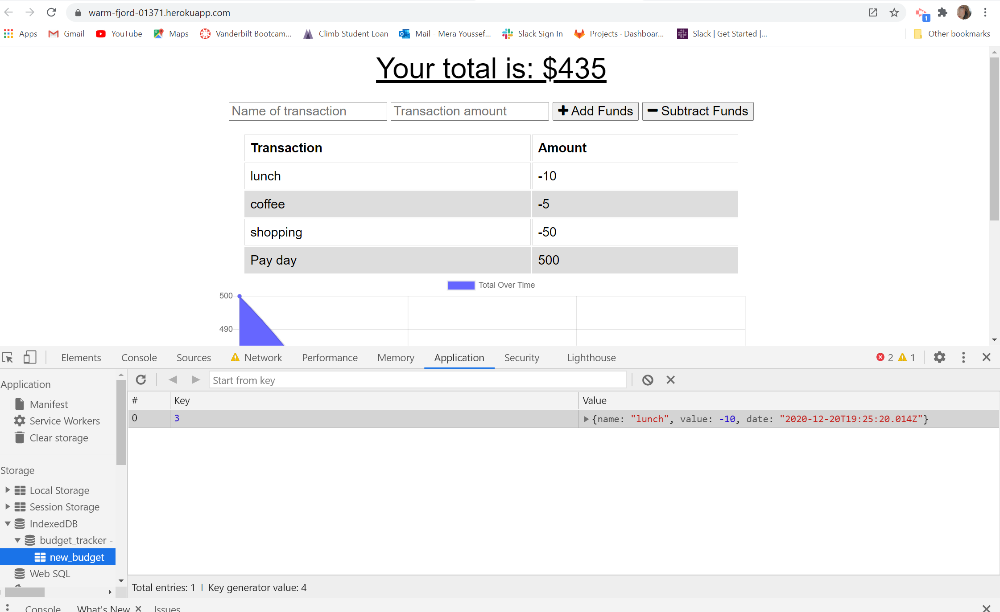
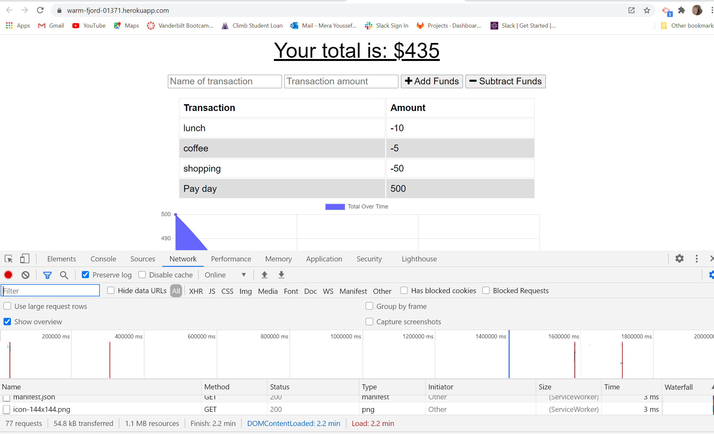
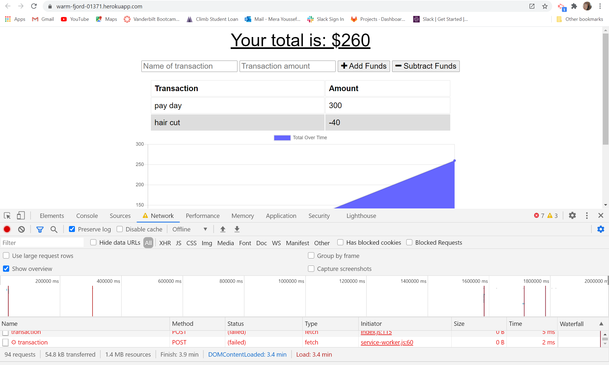
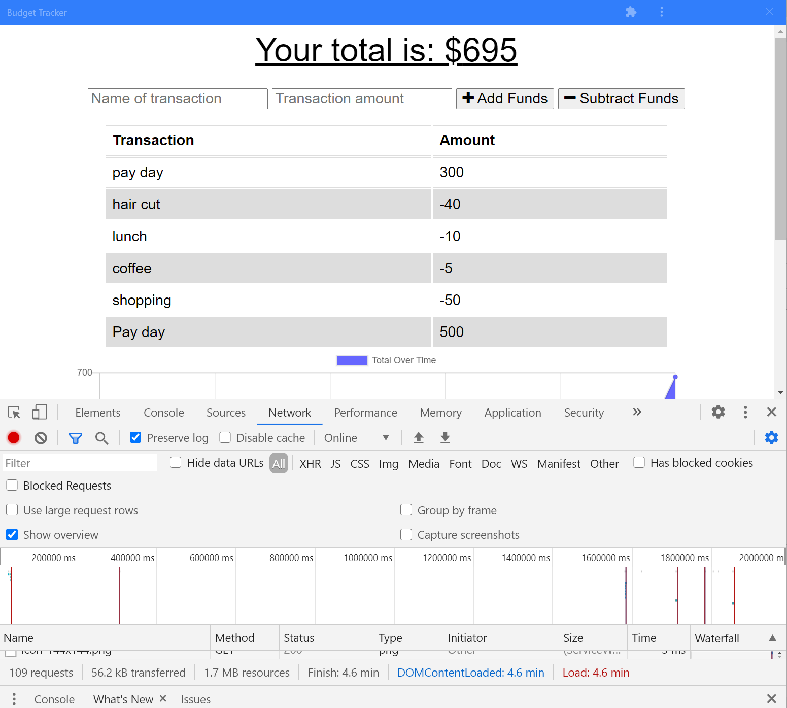

# budget-tracker

## description
A progressive web application that helps manage your budget even without an internet connection. The app can store data if disconnected and will update and save once reconnected. This app can also function without a network. You can also download on your desktop/phone for easier use. 

## user story
AS AN avid traveler  
I WANT to be able to track my withdrawals and deposits with or without a data/internet connection  
SO THAT my account balance is accurate when I am traveling 

## app screenshots

## Github repo
https://github.com/merayoussef/budget-tracker.git
